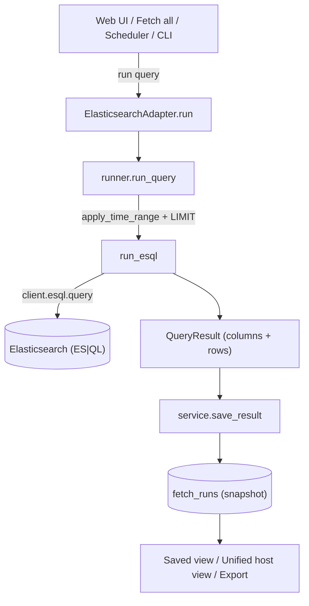

# Elasticsearch Integration — Developer Guide

A single place to understand **how the Elasticsearch integration works** in
assetFlow: architecture, every module, the data flow, the ES|QL query model,
and how run-all, scheduling, persistence, and deduplication behave. Its sibling
is [`tufin_integration.md`](tufin_integration.md); the two adapters share the
same framework, so this guide highlights what is Elasticsearch-specific.

## Contents
- [Big picture](#big-picture)
- [Where everything lives](#where-everything-lives)
- [Data flow](#data-flow)
- [Connection](#connection)
- [Registry: queries & feeds](#registry-queries--feeds)
- [Runner: ES|QL execution](#runner-esql-execution)
- [Time range](#time-range)
- [Unified host view](#unified-host-view)
- [Run-all & scheduler](#run-all--scheduler)
- [Deduplication](#deduplication)
- [Persistence](#persistence)
- [HTTP API & CLI](#http-api--cli)
- [How to add a new ES|QL query](#how-to-add-a-new-esql-query)
- [Testing](#testing)
- [Design decisions & caveats](#design-decisions--caveats)

---

## Big picture

Elasticsearch is assetFlow's **first adapter**. Like every adapter
(`assetflow/adapters.py::Adapter`) it implements one small contract so the web
UI, database, export, unified view, Fetch-all, and scheduler treat it
uniformly:

```
connect_form(form) -> dict      # open a live connection from UI fields
try_auto_connect() -> bool      # best-effort connect from env vars
ping() -> dict                  # cluster info
run(query, limit, time_range) -> QueryResult
```

A **`Query`** (`models.py`) carries an `esql_query` string (Tufin uses
`resource` instead); `is_runnable` is true when the ES|QL body is non-empty.
`run()` executes the ES|QL and returns a **`QueryResult`** (`runner.py`):
`columns` + `rows`. That shared shape is why the same UI, DB, and exports serve
both adapters.

## Where everything lives

| File | Responsibility |
|---|---|
| `assetflow/adapters.py` | `ElasticsearchAdapter` (connect / ping / run) + `default_manager()` |
| `assetflow/client.py` | Cluster connection: `build_client[_from_env]()`, `ping()`, `normalize_host()`, `ConnectionConfigError` |
| `assetflow/runner.py` | `run_query()` / `run_esql()`, `apply_time_range()`, and `QueryResult` (shared with Tufin) |
| `config/asset_intelligence_registry.yaml` | 17 ES|QL queries (AI001–AI017) in 6 feeds, with statuses/notes |
| `assetflow/models.py` | `Query.esql_query`, `Registry` validation (ids unique, categories declared, feeds reference real queries) |
| `assetflow/merge.py` | Unified host view — golden records keyed on `host.name` |
| `assetflow/snapshotdiff.py` | Inventory drift: diff two snapshots into per-host added/removed facts |
| `assetflow/db.py` | `FetchRun` snapshots, `SnapshotChange` (drift log), `Schedule` (adapter-agnostic) |
| `assetflow/service.py` | `run_and_save` / `save_result` / `run_all` (shared) |
| `assetflow/scheduler.py` | `tick_once` + `Scheduler` (shared) |
| `assetflow/cli.py` | `validate/feeds/list/show/test-connection/run/run-feed/serve` |
| `assetflow/webapp.py` | FastAPI endpoints + single-page UI |

## Data flow



## Connection

`client.py` builds an `elasticsearch.Elasticsearch` client. Two connection
targets and two auth styles are supported:

- **Target (one of):** `ELASTICSEARCH_URL` (e.g. `https://host:9200`) or
  `ELASTIC_CLOUD_ID`.
- **Auth (one of):** `ELASTIC_API_KEY` (recommended) or `ELASTIC_USERNAME` +
  `ELASTIC_PASSWORD`.
- **Optional:** `ELASTIC_CA_CERTS`, `ELASTIC_VERIFY_CERTS`,
  `ELASTIC_REQUEST_TIMEOUT` (each also has an `ES_*` alias).

Paths into a connection:
- **UI:** `ElasticsearchAdapter.connect_form(form)` turns a bare host + port
  into a URL via `normalize_host` (a bare host becomes `https://host:9200`),
  then `build_client` + `ping`. Returns cluster info plus the `resolved_url`.
- **Env:** `try_auto_connect()` → `build_client_from_env()`; called at startup.

`ping()` returns `{name, cluster_name, version}` — the UI's connected banner
shows `cluster_name · v<version>`. Credentials are held in memory only.

## Registry: queries & feeds

`config/asset_intelligence_registry.yaml` — **26 queries** in **9 feeds**,
validated by the pydantic `Registry` model (duplicate ids, undeclared
categories, and feeds pointing at missing queries all fail the load).

| Feed | Queries | Theme |
|---|---|---|
| Identity Intelligence | AI001 | user ↔ device mapping |
| User Management Changes | AI002–AI006 | account create/enable/disable/delete, group membership (4720/4722/4725/4726/4728…) |
| Service Change Intelligence | AI007–AI009 | service installed/created, startup-type changes (7045/4697/7040) |
| Application Discovery | AI010–AI012, AI016 | app/service footprint, software versions |
| Database Discovery | AI013–AI015 | DB process/host/version discovery |
| File Integrity Monitoring | AI017 | file create/modify/delete events (needs an FIM source) |
| Authentication & Access Changes | AI018–AI021 | privileged logon, lockout, password reset, failed logon (4672/4740/4724/4625) |
| Security Configuration Changes | AI022–AI025 | scheduled task, audit-policy change, log cleared, firewall rule change (4698/4719/1102/4946–4948) |
| Asset Inventory | AI026 | host inventory (one row per host: OS, IP, agent, cloud) |

### Two kinds of "change"

The feeds split into two shapes, which matters for how change is detected:
- **Change *events*** — anything with an `@timestamp` column (the user-management,
  service-change, auth, and security-config feeds). Each row *is* a change
  (who/what/when), so no diffing is needed.
- **Inventory / state** — the aggregation feeds (AI001, AI010–AI014) describe
  current state; "what changed" is computed by [snapshot drift](#deduplication).

Each query has a **status** (`validated` / `partially_validated` /
`investigation_required` / `not_validated`) and `expected_output_fields`.
Every shipped query now carries an ES|QL body, so all are runnable. `AI016`
(software versions via `package.*`) and `AI017` (file-integrity events) depend
on data sources that may not be ingested in every environment, so they return no
rows there — that's expected, not a failure. A query with an empty `esql_query`
would still be skipped by run-all/`run-feed` and rejected (422) by a direct run.

## Runner: ES|QL execution

`runner.run_query(client, query, limit, time_range)`:
1. Guards against placeholder queries (empty ES|QL).
2. `apply_time_range()` optionally injects a `@timestamp` filter (below).
3. `run_esql()` appends `| LIMIT n` when a limit is given, calls
   `client.esql.query(query=...)`, and normalizes the response body into a
   `QueryResult` (`columns` = ES|QL column metadata, `rows` = values).

`QueryResult` provides `to_dicts()`, `to_json()`, `to_csv()`, `column_names`,
`row_count` — the same object Tufin produces, so DB/export/merge are shared.

## Time range

`apply_time_range(esql, token)` maps a UI token (`24h`/`7d`/`30d`/`90d`) to an
ES|QL timespan and injects `| WHERE @timestamp >= NOW() - <interval>` **right
after the `FROM` command**, so Elasticsearch prunes early. Unknown/empty tokens
(e.g. `all`) leave the query unchanged; the registry text is never modified.
Use it to bound heavy all-index aggregations (e.g. AI001) so they finish fast.

## Unified host view

`merge.build_host_view(records)` folds every saved result carrying a
`host.name` column into one **golden record per host** — the *All Fetched
Results* main table. Each cell summarizes what a query captured for that host
(distinct values of its most identifying column, or a record count). Results
without `host.name` (e.g. service-aggregated AI010/AI012) are reported as
`excluded` and shown as standalone sheets. This is the intra-adapter merge;
Tufin's device resources reuse the same shape by emitting `host.name`.

## Run-all & scheduler

Both are **adapter-agnostic**, so they work for Elasticsearch with no
ES-specific code:
- **Fetch all** (`service.run_all`, `POST /api/adapters/elasticsearch/run-all`)
  runs every runnable AI query once, saving each; placeholders are skipped and
  per-query errors are captured. The header **Fetch all** button drives it.
  Because some AI aggregations are heavy, the button caps rows (`limit=200`);
  pick a time range for the heaviest ones.
- **Schedules** (`db.Schedule` + `scheduler.tick_once`) run a query — or `*`
  (all runnable) — on an interval while the adapter is connected. Configure them
  from the **Schedules** panel; the background thread (started by
  `assetflow serve`) fires due schedules and the panel shows the live heartbeat.

The **Change Log** sidebar entry is Tufin-only (it depends on revision-based
change detection); Elasticsearch has no equivalent resource, so it is correctly
absent.

## Deduplication

Two layers, mirroring the two kinds of change:

**1. Snapshot storage (event feeds & everything else).** Every fetch is an
independent `FetchRun` (columns/rows JSON); the newest per (adapter, query) is
the saved view. Re-running **replaces the view** with a fresh snapshot rather
than accumulating rows, so there is nothing to dedupe at that layer. Aggregation
queries (`STATS … BY host.name`) also dedupe *by construction* — one row per
group. Raw-event feeds are point-in-time: overlapping fetches can show the same
event across different snapshots, but never within one.

**2. Inventory drift (the deduplicated change layer).** For host-keyed
**inventory** queries (no `@timestamp`), each fetch is diffed against the
previous snapshot and the result is upserted into the **`snapshot_changes`**
table — the Elasticsearch analogue of Tufin's `tufin_changes`:

- `snapshotdiff.diff_snapshots(old, new)` builds `host -> {(attribute, value)}`
  facts from the identifying columns (`*.name`/`*Name` and `VALUES()` lists,
  ignoring volatile counts/timestamps), then reports each fact added/removed.
- `service._record_drift` runs automatically inside `save_result` for inventory
  queries (skipping event feeds and Tufin's `change_detail`), comparing the two
  most recent `fetch_runs` and calling `db.record_snapshot_changes`.
- The dedup key is `UNIQUE(adapter, query_id, host, attribute, change_type,
  value, new_run_id)`. Including `new_run_id` means re-diffing the **same**
  snapshot pair never duplicates a transition, while a genuinely new snapshot
  (a later fetch) that re-detects a value records it as a fresh transition.

So drift accumulates deduplicated as fetches happen (manual, Fetch all, or
scheduled). It surfaces two ways in the UI: the per-query **⇄ Diff vs previous
fetch** link (`GET .../change-detail/{query_id}` — an on-demand diff of the last
two fetches) and the adapter-level **⇄ Drift Log** sidebar view
(`GET .../drift` → `db.snapshot_change_log`). Combine with the scheduler for
continuous inventory-drift monitoring, exactly like the Tufin change monitor.

Event-level dedup for the raw-event feeds (keyed on `event.id`) is a possible
further extension but isn't needed — those feeds already emit changes directly.

## Persistence

Shared with Tufin (`db.py`, SQLAlchemy; SQLite by default, `DATABASE_URL` for
Postgres):

| Table | Used by Elasticsearch? |
|---|---|
| `fetch_runs` | yes — every fetch snapshot |
| `snapshot_changes` | yes — deduplicated inventory-drift log |
| `schedules` | yes — recurring fetches |
| `tufin_changes`, `tufin_change_watermarks` | no — Tufin-only |

## HTTP API & CLI

Elasticsearch uses the shared adapter endpoints: `.../connect`,
`.../run/{query_id}`, `.../run-all`, `.../latest|history/{query_id}`,
`.../merged[.csv|.json]`, `.../export…`, plus `/api/schedules*` and
`/api/scheduler`. Drift adds two more:
`GET /api/adapters/{id}/change-detail/{query_id}` (on-demand diff of the last
two fetches) and `GET /api/adapters/{id}/drift` (the deduplicated drift log).

Unlike Tufin, Elasticsearch is also fully driven from the **CLI**:

| Command | What it does |
|---|---|
| `assetflow validate` | Load & validate the registry |
| `assetflow feeds` / `list` / `show <ID>` | Browse the registry |
| `assetflow test-connection` | Verify cluster connectivity |
| `assetflow run <ID> [--limit --range --output]` | Execute one query |
| `assetflow run-feed <FEED_ID>` | Run every runnable query in a feed |
| `assetflow serve` | Launch the web UI (+ scheduler) |

(The CLI's `run`/`test-connection` are Elasticsearch-specific; Tufin is
web-UI-driven.)

## How to add a new ES|QL query

1. **Add the entry** to `config/asset_intelligence_registry.yaml` under an
   existing feed's category:
   ```yaml
   - id: AI018
     category: Application Discovery
     name: Listening Ports By Host
     status: partially_validated
     validated: false
     purpose: Map listening ports to hosts.
     esql_query: |
       FROM logs-*
       | WHERE destination.port IS NOT NULL
       | STATS Ports = VALUES(destination.port) BY host.name
       | SORT host.name ASC
     expected_output_fields: [host.name, Ports]
     recommended_refresh_frequency: Daily
   ```
2. **Reference it** from a feed's `query_ids` (or add a new feed).
3. **That's it** — the CLI, web UI, run-all, scheduler, DB, export, and (because
   it emits `host.name`) the unified view pick it up automatically. Emit
   `host.name` for host-keyed queries; validate the fields against your cluster.
4. **Tests** in `tests/test_registry.py` re-validate the shipped registry, so a
   malformed entry fails fast.

## Testing

Tests use a **fake Elasticsearch client** (see `tests/test_runner.py`,
`tests/test_adapters.py`, `tests/test_webapp.py`) — `client.esql.query` is
monkeypatched to return a canned body, so no live cluster is needed.
`tests/test_registry.py` validates the shipped registry (unique ids, declared
categories, `validated` flag matches status, feeds reference real queries).
`tests/test_merge.py` covers the golden-record logic. Run `pytest`.

## Design decisions & caveats

- **ES|QL requires Elasticsearch 8.11+.** The client pins `elasticsearch>=8.11`.
- **Latest-wins snapshots for the saved view; drift accumulates separately.**
  The per-query view is always the latest fetch, but inventory drift is captured
  cumulatively in `snapshot_changes` (see [Deduplication](#deduplication)). For a
  cumulative *event* log, an event-level dedup sink is a further extension.
- **Field mappings vary by data source.** Several queries are
  `partially_validated` / `investigation_required` because field availability
  (e.g. `winlog.event_data.*`, `process.pe.*`) depends on the ingest pipeline;
  AI016/AI017 return rows only where a software-inventory / FIM source is
  ingested.
- **Heavy aggregations.** All-index `STATS` queries (AI001) can be slow — use
  the time-range control and row limit, or raise the request timeout in the
  connection panel.
