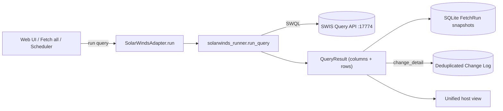

# SolarWinds Integration — Developer Guide

A single place to understand **how the SolarWinds Orion / NCM integration works**
in assetFlow: what it fetches, how the code is laid out, how a fetch flows from
the UI to a normalized result, and — the part this adapter was built for — how it
goes **beyond inventory to track configuration posture and change** on network
devices.

## Contents

- [Where SolarWinds fits](#where-solarwinds-fits)
- [Can we track config posture and change? Yes — here's how](#can-we-track-config-posture-and-change-yes-heres-how)
- [Module map](#module-map)
- [Data flow](#data-flow)
- [Connecting (SWIS / SWQL)](#connecting-swis--swql)
- [The registry](#the-registry)
- [The runner and collectors](#the-runner-and-collectors)
- [System fields vs. custom fields](#system-fields-vs-custom-fields)
- [Config change detail and the change log](#config-change-detail-and-the-change-log)
- [How to add a new SolarWinds resource](#how-to-add-a-new-solarwinds-resource)

## Where SolarWinds fits

assetFlow fetches assets from pluggable **adapters**. Elasticsearch is the first,
**Tufin SecureTrack** the second, **VMware vCenter** the third, and **SolarWinds
Orion** the fourth. Every adapter implements the same `Adapter` interface
(`connect_form` / `ping` / `run`) and produces the same normalized `QueryResult`
(columns + rows), so the database, exports, and unified host view treat all
adapters identically.

Like Tufin and VMware, SolarWinds is a **resource adapter**: a registry query
carries a `resource` name (not an ES|QL body), and the runner maps that name to
the SWQL statement(s) that fetch it. What makes SolarWinds distinct:

- **One interface for everything.** SolarWinds exposes its whole data model —
  nodes, interfaces, NCM config archive, NCM compliance — through a single query
  interface, **SWIS** (SolarWinds Information Service), using **SWQL** (SolarWinds
  Query Language). So the client's one primitive is `query(swql)`, not a REST
  resource tree.
- **Typed inventory.** Every node is tagged with a derived `asset.type` —
  *Router / Switch / Firewall / Load Balancer / Wireless / Server / …* — because
  SolarWinds has no single device-role field.
- **Config posture, not just inventory.** Through **NCM** (Network Configuration
  Manager) the adapter reports the current config each device runs, what changed
  in it over time, and which devices violate compliance policy.

## Can we track config posture and change? Yes — here's how

This was the driving question for the adapter, and the answer is **yes**, via
SolarWinds **NCM**. Four distinct capabilities, all over SWQL:

| Capability | Resource | SWIS entity | What you get |
|---|---|---|---|
| **Current config posture** | `config_inventory` (SW005) | `NCM.ConfigArchive` + `NCM.Nodes` | The latest running & startup config version per device, when it was captured, and whether it is the approved **baseline**. "What config is this device running right now." |
| **Config change history** | `change_detail` (SW006) | `NCM.ConfigArchive` (config text) | *What changed* in a device's config, computed by **diffing consecutive archived configs line by line** (added / removed lines), with the change time. Feeds the deduplicated **Change Log**; supports "since last check". |
| **Baseline drift** | `config_inventory` (SW005) | `NCM.ConfigArchive.Baseline` | Which archived version is the approved baseline, so current-vs-baseline drift is visible per device. |
| **Compliance posture** | `policy_violations` (SW007) | `NCM.PolicyReportResults` / `Cirrus.PolicyReportViolations` | Which devices violate which NCM policy rules (telnet enabled, weak SNMP, missing ACL, …), with severity and remediation. |

The mechanism behind *change* is the same one the Tufin adapter uses for firewall
rule changes: NCM archives each device's config over time; comparing successive
versions yields the change list. NCM's config archive does **not** record the
acting user, so `changed_by` is left blank — config author attribution needs
NCM's real-time change detection (AAA/syslog), which is not exposed to SWQL.

## Module map

| File | Responsibility |
|---|---|
| `assetflow/adapters.py` | `SolarWindsAdapter` (connect / ping / run) + `available_kinds()` that registers the `solarwinds` kind |
| `assetflow/solarwinds_client.py` | SWIS connection: the `SolarWindsClient.query()` / `query_rows()` SWQL primitive, `build_client[_from_env]()`, `ping()`, `SolarWindsConfigError`, port auto-probe (17774 → 17778) |
| `assetflow/solarwinds_runner.py` | Resource collectors + `run_query()` — turns a `resource` into SWQL and a `QueryResult`, classifies nodes, merges `custom.*` columns, and diffs configs |
| `config/solarwinds_registry.yaml` | The 7 resources (SW001–SW007) grouped into 7 feeds, with statuses/notes |
| `tests/test_solarwinds.py` | Adapter, registry, and normalization tests (no live SolarWinds) |

## Data flow

## Connecting (SWIS / SWQL)

`SolarWindsClient` (`solarwinds_client.py`) POSTs a SWQL statement to::

    https://<host>:17774/SolarWinds/InformationService/v3/Json/Query

with HTTP Basic auth, and returns the parsed `{"results": [...]}` body. Details:

- **One primitive.** `query(swql)` runs a statement; `query_rows(swql)` returns
  just the `results` list. Everything the runner does is built from these.
- **Port auto-probe.** SWIS listens on `17774` on the modern SolarWinds Platform
  and on `17778` on older deployments. The client tries the configured port
  first, then the fallback, and remembers whichever answered.
- **Stdlib by default.** `urllib` is used unless `requests` is installed. A
  401/403 surfaces as an auth error; an HTTP 400 is a SWQL/entity error and is
  raised with the server's message so the runner can fall back to an alternate
  entity/field set.

Connection entry points:

- **From the UI:** `SolarWindsAdapter.connect_form(form)` reads host / username /
  password / port / verify_certs / timeout and calls `ping()`.
- **From the environment:** `build_client_from_env()` reads `SWIS_HOSTNAME`,
  `SWIS_USERNAME`, `SWIS_PASSWORD` (plus optional `SWIS_PORT`,
  `SWIS_VERIFY_CERTS`, `SWIS_REQUEST_TIMEOUT`); `try_auto_connect()` uses it at
  startup.

`ping()` runs a trivial metadata SWQL (also reporting the SWIS version) and
checks whether the NCM entities are registered, so the UI can hint *"NCM not
detected"* when the config-posture resources will be empty.

## The registry

`config/solarwinds_registry.yaml` is validated by the same pydantic `Registry`
model as the other adapters. The seven resources:

| ID | Resource | SWIS entity/entities | Notes |
|---|---|---|---|
| SW001 | `nodes` | `Orion.Nodes` ⋈ `Orion.NodesCustomProperties`, `Orion.NodeMACAddresses` | Typed inventory + `custom.*` + MAC |
| SW002 | `interfaces` | `Orion.NPM.Interfaces` ⋈ `Orion.Nodes` | Needs NPM |
| SW003 | `volumes` | `Orion.Volumes` ⋈ `Orion.Nodes` | Disks / volumes |
| SW004 | `custom_properties` | `Orion.CustomProperty` | Catalog of custom-field definitions |
| SW005 | `config_inventory` | `NCM.ConfigArchive` ⋈ `NCM.Nodes` | Current config posture (needs NCM) |
| SW006 | `change_detail` | `NCM.ConfigArchive` (config text) | Config change diffs → Change Log |
| SW007 | `policy_violations` | `NCM.PolicyReportResults` (+ variants) | Compliance posture |

Entity names vary across releases — the modern `NCM.*` namespace vs. the legacy
`Cirrus.*` one — so the NCM collectors try both. `Cirrus.*` and `NCM.*` point at
the same underlying tables; `NCM.*` is preferred.

## The runner and collectors

`solarwinds_runner.run_query(client, query, limit, time_range, node_scan_limit,
watermark_store)` dispatches on the query's `resource` to a `_collect_*`
collector, each returning `(columns, rows)` capped by `limit`. Key helpers:

- `_first_query(client, swqls)` — run the first SWQL variant that succeeds; a bad
  entity/field (HTTP 400) falls through to the next, and `[]` is returned when
  every variant fails (e.g. NCM not licensed). This is the SWQL analogue of the
  Tufin/VMware `_first_payload`.
- `_paged_rows(client, swql)` — page a listing with `WITH ROWS a TO b WITH
  TOTALROWS`, falling back to a single unpaged fetch if the entity rejects paging.
- `_classify_node(vendor, machine_type, description, subtype)` — derive the
  `asset.type` by keyword-matching vendor/machine-type/description, with a
  WMI/Agent poll-method fallback to *Server*.
- `_custom_property_names(client)` — the note's dynamic probe: `SELECT TOP 1 *
  FROM Orion.NodesCustomProperties`, minus the base/system columns.

The config collectors are bounded by `node_scan_limit` (default 100 nodes) so
fetching (potentially large) config text can't fan out unbounded on big estates.

## System fields vs. custom fields

The standard Orion.Nodes columns are the **system fields**. The **custom fields**
are SolarWinds node custom properties, and the integration's explicit ask was to
*prefix them so system and custom fields are never confused*. So:

- The custom-property column names are **discovered dynamically** (`SELECT TOP 1
  * FROM Orion.NodesCustomProperties`, minus base columns), then **LEFT JOINed**
  onto the node query.
- Each is emitted as its own column **prefixed `custom.`** (e.g.
  `custom.Department`), appended after the standard columns.
- A node missing a given property gets a blank, never a misaligned value.

When `SELECT *` is unsupported or no custom properties exist, no `custom.*`
columns appear and the standard inventory is unaffected. SW004 lists the custom
*definitions* so you can see which fields exist before relying on specific
`custom.*` columns.

## Config change detail and the change log

`change_detail` (SW006) is special-cased end to end, exactly like Tufin's:

- For each NCM node it fetches the two most recent **Running** configs (with
  text) and `difflib`s them into per-line **added** / **removed** rows. Volatile
  lines (e.g. `! Last configuration change at …`) are dropped so they don't read
  as real edits.
- The result columns match the change-log shape
  (`host.name, revision.id, @timestamp, changed_by, change_type, rule.uid,
  before, after, authorized, requester`), where `revision.id` is the newer
  config's globally-unique `ConfigID` and `rule.uid` is a stable per-line
  content hash.
- `service.save_result` routes any `change_detail` result into
  `db.record_changes`, which **dedupes** by `(adapter, revision.id, rule.uid,
  change_type)` — so re-fetching in any mode never double-counts a change. The
  accumulated log is the **Change Log** overview in the sidebar.
- The **"since last check"** range selects the incremental mode: a per-node
  watermark (stored in the DB, scoped to the adapter) records the last-seen
  `ConfigID`; a device is diffed only when its newest config differs, and the
  first run establishes a baseline silently.

## How to add a new SolarWinds resource

1. **Write a collector** in `solarwinds_runner.py`:
   `_collect_<resource>(client, scan) -> (columns, rows)`. Emit a `host.name`
   column first (so rows fold into the unified view). Use `_first_query` for
   entity/field fallbacks, `_paged_rows` for large listings, and `textish` for
   values.
2. **Register it** in the `_COLLECTORS` map.
3. **Add a registry entry** (`SW0xx`) and a feed in
   `config/solarwinds_registry.yaml`, with an honest `status` and `notes` naming
   the SWIS entity/entities.
4. **Add a test** in `tests/test_solarwinds.py` using `FakeClient` (SWQL→rows
   rules) — no live SolarWinds needed.
