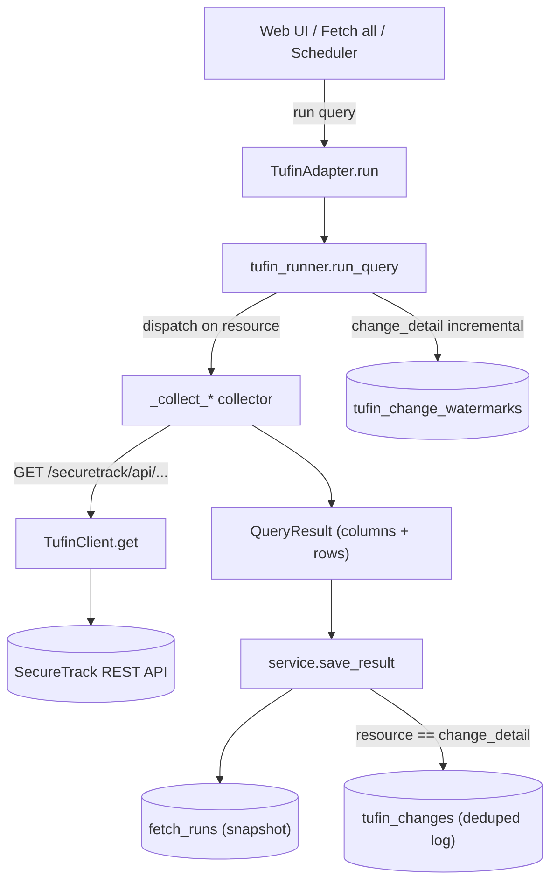

# Tufin Integration — Developer Guide

A single place to understand **how the Tufin SecureTrack integration works** in
assetFlow: the architecture, every module involved, the data flow, the
change-detection logic, and how to extend it. If you only need the raw
SecureTrack field/endpoint reference, see
[`tufin_securetrack_api_reference.md`](tufin_securetrack_api_reference.md); this
guide is about the *code*.

## Contents
- [Big picture](#big-picture)
- [Where everything lives](#where-everything-lives)
- [Data flow](#data-flow)
- [Connection](#connection)
- [Registry: resources & feeds](#registry-resources--feeds)
- [Runner: fetch & normalize](#runner-fetch--normalize)
- [Change detection (TUF008)](#change-detection-tuf008)
- [Deduplicated change log](#deduplicated-change-log)
- [Persistence](#persistence)
- [Fetch-all & scheduler](#fetch-all--scheduler)
- [HTTP API](#http-api)
- [How to add a new Tufin resource](#how-to-add-a-new-tufin-resource)
- [Testing](#testing)
- [Design decisions & caveats](#design-decisions--caveats)

---

## Big picture

assetFlow is built around **adapters** — pluggable data sources. Elasticsearch
is the first; **Tufin SecureTrack** is the second. Every adapter implements the
same small contract (`assetflow/adapters.py::Adapter`) so the web UI, database,
export, unified view, and scheduler treat them uniformly:

```
connect_form(form) -> dict      # open a live connection from UI fields
try_auto_connect() -> bool      # best-effort connect from env vars
ping() -> dict                  # re-check connectivity
run(query, limit, time_range) -> QueryResult   # fetch one registry query
```

The trick that makes two very different sources fit one framework: a **`Query`**
(`models.py`) carries *either* an Elasticsearch `esql_query` *or* a Tufin
`resource` name. `Query.is_runnable` is true if either is set. Elasticsearch
runs ES|QL; Tufin maps the `resource` to SecureTrack REST endpoint(s). Both
return the same shape — a **`QueryResult`** (`runner.py`): `columns` +
`rows` — so everything downstream is source-agnostic.

## Where everything lives

| File | Responsibility |
|---|---|
| `assetflow/adapters.py` | `TufinAdapter` (connect / ping / run) + `default_manager()` that registers it |
| `assetflow/tufin_client.py` | SecureTrack REST connection: `TufinClient.get()`, `build_client[_from_env]()`, `ping()`, `TufinConfigError` |
| `assetflow/tufin_runner.py` | Resource collectors + `run_query()` — turns a `resource` into REST calls and a `QueryResult` |
| `config/tufin_registry.yaml` | The 8 resources (TUF001–TUF008) grouped into 7 feeds, with statuses/notes |
| `assetflow/models.py` | `Query.resource`, `Query.is_runnable`, `Registry` validation |
| `assetflow/db.py` | `FetchRun` (snapshots), `TufinChange` (change log), `ChangeWatermark`, `Schedule` + accessors |
| `assetflow/service.py` | `run_and_save` / `save_result` / `run_all` — shared run→persist→changelog step |
| `assetflow/scheduler.py` | `tick_once(manager, now)` + the `Scheduler` daemon thread |
| `assetflow/webapp.py` | FastAPI endpoints + the single-page UI (connection, Fetch all, Schedules, Change Log) |
| `docs/tufin_securetrack_api_reference.md` | Confirmed R25-2 endpoints & DTO fields |

## Data flow



## Connection

`TufinClient` (`tufin_client.py`) is a thin HTTP-Basic REST client rooted at
`https://<host>/securetrack/api/`. It uses `requests` when installed and falls
back to `urllib` otherwise, so the adapter has no hard dependency.

- **From the UI:** `TufinAdapter.connect_form(form)` reads host / username /
  password / base path / verify-TLS / timeout and calls `connect()`, which
  builds the client and `ping()`s it (trying `devices.json?count=1` and
  friends). A 401/403 surfaces as an auth error rather than a silent retry.
- **From env:** `try_auto_connect()` reads `TOS_HOSTNAME` / `TOS_USERNAME` /
  `TOS_PASSWORD` (+ optional `TUFIN_BASE_PATH`, `TUFIN_VERIFY_CERTS`,
  `TUFIN_REQUEST_TIMEOUT`). Called at startup for every adapter.

Credentials live **in memory only** (never written to disk). Because of that,
after a restart the adapter must reconnect before scheduled fetches resume —
set the `TOS_*` env vars for unattended operation.

## Registry: resources & feeds

`config/tufin_registry.yaml` is validated by the same pydantic `Registry` model
as Elasticsearch. Each entry names a **`resource`** (no `esql_query`).

| ID | Resource | Feed | Host-keyed? |
|---|---|---|---|
| TUF001 | `devices` | Device Inventory | yes (`host.name` = device) |
| TUF002 | `revisions` | Change History | yes |
| TUF003 | `rules` | Policy Rules | yes |
| TUF004 | `network_objects` | Network Objects & Services | yes |
| TUF005 | `services` | Network Objects & Services | yes |
| TUF006 | `zones` | Segmentation & Topology | no (sheet only) |
| TUF007 | `cleanups` | Policy Hygiene | yes |
| TUF008 | `change_detail` | Change Detection | yes |

Host-keyed resources emit a `host.name` column (the device/CI name) so they fold
into the adapter's **All Fetched Results** golden-record view (`merge.py`), and
set up eventual cross-adapter correlation.

**Statuses** are honest: paths + fields are confirmed against the R25-2 Swagger,
but resources stay `partially_validated` / `investigation_required` until run
against a live TOS box.

## Runner: fetch & normalize

`tufin_runner.run_query(client, query, limit, time_range, watermark_store)`:
1. Reads `query.resource`, looks it up in `_COLLECTORS`.
2. Calls the collector → `(columns, rows)`.
3. Applies `limit` (and, for non-`change_detail` resources, a generic
   `@timestamp` time-range post-filter).

Each `_collect_*` collector fetches from SecureTrack and flattens the JSON. Key
helpers:
- `unwrap_items(payload, keys)` — pull a record list out of SecureTrack's
  envelopes (list, `{revisions:[...]}`, nested, etc.).
- `textish(value)` — render nested/lists/dicts as compact strings (rule
  source/dest/service are often object references).
- `_first(record, *keys)` — first non-empty of several candidate field names
  (defensive against vendor/version differences).
- `_fetch_devices` / `_collect_per_device` — most resources are per-device;
  device scan is capped by `DEFAULT_DEVICE_SCAN` (25) to bound REST calls.
- `_first_payload(client, paths)` — try alternate endpoint paths (`.json` vs
  not), first success wins.

## Change detection (TUF008)

SecureTrack exposes revision **snapshots**, not a field-level changelog — so
"what changed" is **computed** by diffing consecutive revisions' rulebases
(`_collect_change_detail`). This mirrors the original Tufin change-detector
prototype.

For a revision pair (older → newer):
1. Fetch each revision's rules (`/revisions/{id}/rules`), keyed by `uid`
   (`_revision_rules`, cached per fetch).
2. Diff by uid: **added** (only in new), **removed** (only in old), **modified**
   (fingerprint differs). `_rule_fingerprint` hashes source/dest/service/action/
   disabled and **excludes the name**, so a pure rename is not a change.
3. Emit a row: `host.name, revision.id, @timestamp, changed_by (admin),
   change_type, rule.uid, before, after, authorized, requester`.
4. `authorized` / `requester` come from `/change_authorization?old_version=&new_version=`
   (`_authorization`) — populated only when SecureChange ticket authorization is
   enabled; blank otherwise.

### Which revisions get compared — three modes

The range control selects the revision window (`MAX_CHANGE_PAIRS = 25` cap):

| Mode (`time_range`) | Selection | Use |
|---|---|---|
| `all`/none | latest two revisions (`_select_change_pairs`) | quick "latest change" |
| `24h`/`7d`/`30d`/`90d` | every revision in the window + the one before it (baseline), each pair diffed | on-demand audit |
| `incremental`/`since`/`new` | only revisions newer than the device **watermark**, then advance it (`_incremental_pairs`) | **continuous monitoring** |

Incremental mode reads/writes a per-device watermark via a `watermark_store`
(the adapter passes a DB-backed one). First run records a baseline silently
(no history dump); later runs report each change **exactly once** with no missed
intermediate revisions — regardless of gap between runs.

## Deduplicated change log

Every `change_detail` fetch — any mode, any repeats — upserts its rows into the
`tufin_changes` table via `db.record_changes`, keyed by a **`UNIQUE(adapter,
revision_id, rule_uid, change_type)`** constraint. Because a SecureTrack
`revision_id` is globally unique and a revision's diff is deterministic, the
same change always maps to the same key → stored exactly once. `db.change_log`
reads it newest-first for the UI's **⟳ Change Log** view. The per-fetch
snapshots in `fetch_runs` are untouched; the change log is an additive layer.

## Persistence

All in `db.py` (SQLAlchemy; SQLite by default, `DATABASE_URL` for Postgres):

| Table | Purpose |
|---|---|
| `fetch_runs` | Every fetch as a snapshot (columns/rows JSON); newest per (adapter, query) is the saved view |
| `tufin_changes` | Deduplicated cumulative change log |
| `tufin_change_watermarks` | Last revision seen per (adapter, device) — incremental mode |
| `schedules` | Recurring fetch definitions |

## Fetch-all & scheduler

`service.py` centralizes the run→persist→changelog step so the Run button,
Fetch all, and the scheduler behave identically:
- `save_result(adapter, query, result, ...)` — persist an already-run result
  (used by the interactive Run, which runs the query itself for the timeout hint).
- `run_and_save(...)` — run + save (used by Fetch all / scheduler).
- `run_all(adapter, ...)` — run every runnable query, capturing per-query errors.

`scheduler.py` runs `Schedule` rows on their interval. `tick_once(manager, now)`
finds due schedules (`db.due_schedules`), runs each (single query or `*` = all),
and calls `db.mark_schedule_ran`. It **skips disconnected adapters** (leaving
them due) so they resume on reconnect. `Scheduler` is the daemon thread wrapper;
`assetflow serve` starts it (`create_app(..., start_scheduler=True)`), and
`status()` exposes the heartbeat. **Intended monitoring setup:** schedule
*All endpoints* + *Since last check* every 5–15 min.

## HTTP API

Tufin uses the shared adapter endpoints plus a few additions:

| Method & path | Purpose |
|---|---|
| `POST /api/adapters/tufin/connect` | Connect from the UI form |
| `POST /api/adapters/tufin/run/{query_id}?limit=&range=` | Run one resource |
| `POST /api/adapters/tufin/run-all?limit=&range=` | Fetch all runnable resources |
| `GET /api/adapters/tufin/changelog` | The deduplicated change log |
| `GET /api/adapters/tufin/merged[.csv/.json]` | Unified host view |
| `GET/POST /api/schedules`, `POST /api/schedules/{id}/toggle`, `DELETE /api/schedules/{id}` | Schedule CRUD |
| `GET /api/scheduler` | Scheduler heartbeat |

## How to add a new Tufin resource

Example: add rule last-hit usage (`/rule_last_usage/find_all/{device_id}`).

1. **Write a collector** in `tufin_runner.py`:
   ```python
   def _collect_rule_usage(client, scan):
       columns = ["host.name", "rule.uid", "last_hit"]
       def paths_for(device_id, name, device):
           return (f"rule_last_usage/find_all/{device_id}.json",
                   f"rule_last_usage/find_all/{device_id}")
       def row_for(item, device_id, name):
           return [name, str(_first(item, "uid", "rule_uid")),
                   textish(_first(item, "last_hit", "date"))]
       return _collect_per_device(client, scan, paths_for,
                                  ("rule_last_usage", "rule"), columns, row_for)
   ```
2. **Register it** in `_COLLECTORS`: `"rule_usage": _collect_rule_usage`.
3. **Add the registry entry** in `config/tufin_registry.yaml` (id `TUF009`,
   `resource: rule_usage`, a feed, an honest status, `expected_output_fields`).
4. **Add a test** in `tests/test_tufin.py` with a `FakeClient` payload.

That's it — the UI, DB, export, unified view, Fetch all, and scheduler pick it
up automatically because everything keys off the registry + `QueryResult`.
Emit a `host.name` column if it's device-scoped so it joins the unified view.
Confirm endpoint paths/fields against the target release's `/securetrack/apidoc/`.

## Testing

`tests/test_tufin.py` uses a **`FakeClient`** — a `{path: payload}` map whose
`.get(path)` mirrors the real client (unknown paths raise, exercising the
fallback logic). No live SecureTrack or network is touched. Coverage includes
registry validation, each collector's normalization (with the real R25-2 DTO
shapes), the three change-detail modes, dedup, watermarks, schedule CRUD, and a
scheduler tick. Run `pytest`.

## Design decisions & caveats

- **Snapshots, not diffs.** SecureTrack has no field-level change endpoint and
  no server-side date filter on revisions, so change detection and range
  selection are client-side; only selected revisions' rules are fetched.
- **"Who" is vendor-dependent.** `admin` is direct for most managements; for
  Cisco/Fortinet/Juniper/Palo Alto it needs syslog monitoring configured.
- **No `/audit_logs` in R25-2.** An earlier speculative resource was removed;
  the change signal is revisions + `change_authorization`.
- **CLI is Elasticsearch-only for live fetch.** Tufin is driven from the web UI
  (`assetflow serve`); the registry commands (`validate/list/show/feeds`) do
  work with `--registry config/tufin_registry.yaml`.
- **Scheduler needs a live connection.** In-memory credentials mean env-based
  auto-connect is required for unattended scheduling.
