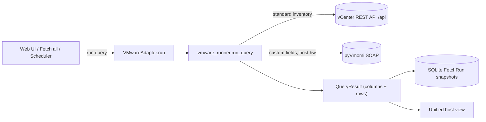

# VMware Integration — Developer Guide

A single place to understand **how the VMware vCenter integration works** in
assetFlow: what it fetches, how the code is laid out, how a fetch flows from the
UI to a normalized result, and how the standard inventory (REST) and the custom
fields (pyVmomi) fit together.

## Contents

- [Where VMware fits](#where-vmware-fits)
- [Module map](#module-map)
- [Data flow](#data-flow)
- [Connecting](#connecting)
- [The registry](#the-registry)
- [The runner and collectors](#the-runner-and-collectors)
- [System fields vs. custom fields](#system-fields-vs-custom-fields)
- [How to add a new VMware resource](#how-to-add-a-new-vmware-resource)

## Where VMware fits

assetFlow fetches assets from pluggable **adapters**. Elasticsearch is the first,
**Tufin SecureTrack** the second, and **VMware vCenter** the third. Every adapter
implements the same `Adapter` interface (`connect_form` / `ping` / `run`) and
produces the same normalized `QueryResult` (columns + rows), so the database,
exports, and unified host view treat all adapters identically.

Like Tufin, VMware is a **resource adapter**: a registry query carries a
`resource` name (not an ES|QL body), and the runner maps that name to the
vCenter endpoint(s) that fetch it. What makes VMware distinct:

- **Asset kind is explicit.** Every row carries an `asset.type` column, so
  *virtual servers* (`Virtual Machine`) and *physical servers*
  (`Physical Host (ESXi)`) — plus clusters, datastores, and datacenters — are
  distinguishable at a glance.
- **Two interfaces, one client.** Standard inventory comes over the vSphere
  Automation **REST API**; vCenter **Custom Attributes** come over the SOAP SDK
  (**pyVmomi**) and are merged in under `custom.`-prefixed columns.

## Module map

| File | Responsibility |
|---|---|
| `assetflow/adapters.py` | `VMwareAdapter` (connect / ping / run) + `available_kinds()` that registers the `vmware` kind |
| `assetflow/vmware_client.py` | vCenter connection: REST session (`VMwareClient.get()`), `build_client[_from_env]()`, `ping()`, `VMwareConfigError`, and the pyVmomi-backed `custom_values()` / `custom_field_defs()` / `host_hardware()` |
| `assetflow/vmware_runner.py` | Resource collectors + `run_query()` — turns a `resource` into vCenter calls and a `QueryResult`, and merges the `custom.*` columns |
| `config/vmware_registry.yaml` | The 6 resources (VMW001–VMW006) grouped into 6 feeds, with statuses/notes |
| `tests/test_vmware.py` | Adapter, registry, and normalization tests (no live vCenter, no pyVmomi required) |

## Data flow

## Connecting

`VMwareClient` (`vmware_client.py`) speaks two protocols against the same host:

- **REST** — `login()` POSTs to `/api/session` (HTTP Basic) and caches the
  returned `vmware-api-session-id`; `get(path)` calls `/api/<path>` with that
  header and unwraps both the modern raw arrays and the legacy `{"value": …}`
  envelopes. Stdlib `urllib` by default, `requests` when installed. A 401 mid-run
  triggers one transparent re-login.
- **SOAP (pyVmomi)** — `_soap_content()` lazily `SmartConnect`s and caches the
  `ServiceInstanceContent`. Only the custom-fields / host-hardware methods use
  it, and each raises or returns empty gracefully when pyVmomi is not installed.

Connection entry points:

- **From the UI:** `VMwareAdapter.connect_form(form)` reads host / username /
  password / port / verify_certs / timeout and calls `ping()` (session login +
  a lightweight inventory read) to validate.
- **From the environment:** `build_client_from_env()` reads `VC_HOSTNAME`,
  `VC_USERNAME`, `VC_PASSWORD` (plus optional `VCENTER_PORT`,
  `VCENTER_VERIFY_CERTS`, `VCENTER_REQUEST_TIMEOUT`); `try_auto_connect()` uses it
  at startup.

The `ping()` summary reports the vCenter version/build and whether pyVmomi is
available, so the UI can show *"custom fields off (pyVmomi not installed)"* when
it is not.

## The registry

`config/vmware_registry.yaml` is validated by the same pydantic `Registry` model
as the other adapters. Each query names a `resource` the runner knows how to
fetch. The six resources:

| ID | Resource | Endpoint(s) | `asset.type` |
|---|---|---|---|
| VMW001 | `virtual_machines` | `/vcenter/vm` (+ `/vm/{id}`, `/vm/{id}/guest/identity`) | `Virtual Machine` |
| VMW002 | `hosts` | `/vcenter/host` (+ pyVmomi `HostSystem.summary`) | `Physical Host (ESXi)` |
| VMW003 | `clusters` | `/vcenter/cluster` | `Compute Cluster` |
| VMW004 | `datastores` | `/vcenter/datastore` | `Datastore` |
| VMW005 | `datacenters` | `/vcenter/datacenter` | `Datacenter` |
| VMW006 | `custom_attributes` | pyVmomi `customFieldsManager` | — |

## The runner and collectors

`vmware_runner.run_query(client, query, limit, time_range, vm_detail_scan)`
dispatches on the query's `resource` to a `_collect_*` collector, each returning
`(columns, rows)` which are capped by `limit`. `time_range` is accepted for
interface parity but not applied — vCenter inventory is a point-in-time snapshot.

Key helpers:

- `unwrap_items` / `unwrap_obj` — pull records out of either the modern raw
  arrays or the legacy `{"value": …}` envelopes.
- `textish` — flatten nested fields (including vCenter's localizable
  `{"default_message": …}` messages) to compact strings.
- `_first_payload` — try endpoint variants until one responds.
- `_optional(client, method)` — call the pyVmomi-backed `custom_values` /
  `host_hardware` defensively; any failure degrades to no enrichment.

The VM collector lists all VMs from `/vcenter/vm` in one call, then enriches the
first `vm_detail_scan` (default 200) with per-VM detail and guest identity to
bound the REST calls on large estates — every VM is still listed with its summary
fields and custom attributes.

## System fields vs. custom fields

The standard columns are the **system fields** (from REST / pyVmomi host
hardware). The **custom fields** are vCenter Custom Attributes, read via
`client.custom_values()` as `{moid: {name: value}}` and merged by
`_merge_custom`:

- The set of custom columns is the **sorted union** of attribute names present
  on the objects in scope.
- Each is emitted as its own column **prefixed `custom.`** (e.g.
  `custom.System Owner`), appended after the standard columns.
- Rows are padded so an object missing a given attribute gets a blank, never a
  misaligned value.

The moid join works because the REST object id (`vm-123`, `host-45`) equals the
pyVmomi `_moId`. When pyVmomi is unavailable, `custom_values()` isn't called and
no `custom.*` columns appear — the standard inventory is unaffected.

## How to add a new VMware resource

1. **Write a collector** in `vmware_runner.py`:
   `_collect_<resource>(client, scan) -> (columns, rows)`. Emit a `host.name`
   column first (so rows fold into the unified view) and an `asset.type` where
   it makes sense. Use `_first_payload` for endpoint fallbacks and `textish`
   for nested fields. If the resource is per-VM/host, call `_merge_custom` to
   attach `custom.*` columns.
2. **Register it** in the `_COLLECTORS` map.
3. **Add a registry entry** (`VMW0xx`) and a feed in
   `config/vmware_registry.yaml`, with an honest `status` and `notes` naming the
   endpoint(s).
4. **Add a test** in `tests/test_vmware.py` using `FakeClient` (canned REST
   payloads + optional `custom`/`hardware`/`defs`) — no live vCenter or pyVmomi
   needed.
